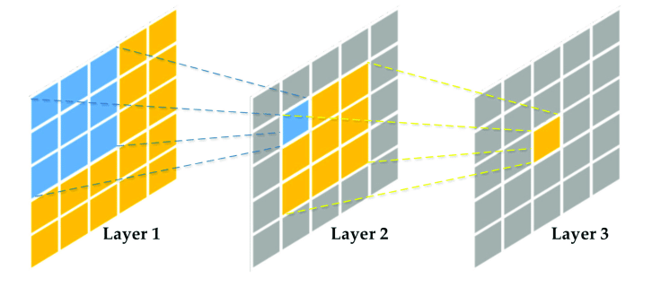

# Pytorch Classification
This PyTorch repository provides code for training and evaluating image classification models. It includes various export options and supports quantization for deployment. In addition, it allows easy integration of custom datasets and custom models. Please refer to the README for further details.

## Quick Start

<details>
<summary>Environment</summary>

Clone the repo and build the docker image

```Shell
git clone https://github.com/ahosnyyy/pytorch-classification.git
cd pytorch-classification
docker build --tag fashion .
```
</details>

<details>
<summary>Run</summary>

Run the container and mount the repo

```Shell
docker run -p 6006:6006 --gpus all -it -v /path/to/repo/pytorch-classification:/app/classification fashion
cd classification
```
</details>

<details>
<summary>Download Models</summary>

Here are 3 models trained for 100 epochs on FashionMNIST dataset, you can download them from:

|Checkpoints| | |
|----|----|---|
| [```resnet18.pth```](https://github.com/ahosnyyy/pytorch-classification/releases/download/v0.1.0/resnet18.pth) | [```mobilenet_v3_small.pth```](https://github.com/ahosnyyy/pytorch-classification/releases/download/v0.1.0/mobilenet_v3_small.pth) | [```custom.pth```](https://github.com/ahosnyyy/pytorch-classification/releases/download/v0.1.0/custom.pth) |
|**ONNX**|||
| [```resnet18_onnx.onnx```](https://github.com/ahosnyyy/pytorch-classification/releases/download/v0.1.0/resnet18_onnx.onnx) | [```mobilenet_v3_small_onnx.onnx```](https://github.com/ahosnyyy/pytorch-classification/releases/download/v0.1.0/mobilenet_v3_small_onnx.onnx) | [```custom_onnx.onnx```](https://github.com/ahosnyyy/pytorch-classification/releases/download/v0.1.0/custom_onnx.onnx) |
|**TorcchScript**|||
| [```resnet18_torchscript.pt```](https://github.com/ahosnyyy/pytorch-classification/releases/download/v0.1.0/resnet18_torchscript.pt) | [```mobilenet_v3_small_torchscript.pt```](https://github.com/ahosnyyy/pytorch-classification/releases/download/v0.1.0/mobilenet_v3_small_torchscript.pt) | [```custom_torchscript.pt```](https://github.com/ahosnyyy/pytorch-classification/releases/download/v0.1.0/custom_torchscript.pt) |
|**Quantized**|||
| [```resnet18_quantized.pth```](https://github.com/ahosnyyy/pytorch-classification/releases/download/v0.1.0/resnet18_quantized.pth) | [```mobilenet_v3_small__quantized.pth```](https://github.com/ahosnyyy/pytorch-classification/releases/download/v0.1.0/mobilenet_v3_small_quantized.pth) | [```custom_quantized.pth```](https://github.com/ahosnyyy/pytorch-classification/releases/download/v0.1.0/custom_quantized.pth) |

After downloading, move them to [`/weights`](./weights/) directory.

</details>

<details>
<summary>Inference [onnx/TorchScript]</summary>

To classify an image using the script, run the following command:
```Shell
python3 predict.py --image /path/to/image.jpg --model /path/to/model.[onnx/pt] --classes /path/to/classes.txt --engine [onnx/torchscript]
```

For example:
```Shell
python3 predict.py --image ./assets/images/ankleboot_image_0.png --model ./weights/resnet18/resnet18_onnx.onnx --classes ./data/FashionMNIST/classes.txt --engine onnx
```

To see the list of available options and their descriptions, run:
```Shell
python3 predict.py --help
```
</details>

<details>
<summary>Inference [Checkpoint]</summary>

To classify an image using the script, run the following command:
```Shell
python3 predict_ckpoint.py --image /path/to/image.jpg --model model-name --weights /path/to/weights.pth --classes /path/to/classes.txt
```

For example:
```Shell
python3 predict_ckpoint.py --image ./assets/images/ankleboot_image_0.png --model resnet18 --weights ./weights/resnet18/resnet18.pth --classes ./data/FashionMNIST/classes.txt
```

To see the list of available options and their descriptions, run:
```Shell
python predict_ckpoint.py --help
```
</details>

<details>
<summary>Evaluation</summary>

Here is an example on how to use the provided script for evaluation:
```Shell
python3 eval.py --model [resnet18/mobilenet_v3_small/custom] --weights /path/to/weights.pth --dataset /path/to/dataset --cuda
```
For example:

```Shell
python3 eval.py --model resnet18 --weights ./weights/resnet18/resnet18.pth --cuda 
```
This will dump a ```resnet.json``` file inside the ```results``` folder that contains the evaluation results.

Note that the default dataset is FashionMNIST, to see the list of available options and their descriptions, run:
```Shell
python3 eval.py --help
```

</details>

<details>
<summary>Training</summary>

Here is an example on how to use the provided script for training:
```Shell
python3 train.py --model resnet18 --pretrained --optimizer adamw --base_lr 4e-3 --min_lr 1e-6 --weight_decay 0.01 --batch_size 64 --num_workers 4 --max_epoch 200 --eval_epoch 5 --path_to_save trained_models/ --tensorboard --fp16
```

To see the list of available options and their descriptions, run:
```Shell
python3 train.py --help
```

Here is a table summarize the options:

| Option | Type | Default | Description |
|:-------:|:------:|:---------:|-------------|
| --cuda | flag | False | Use CUDA for inference if available. |
| --batch_size | int | 128 | Batch size for inference. |
| --wp_epoch | int | 20 | Number of warmup epochs. |
| --start_epoch | int | 0 | Starting epoch for training. |
| --max_epoch | int | 300 | Maximum number of training epochs. |
| --eval_epoch | int | 1 | Evaluate the model every eval_epoch epochs during training. |
| --num_workers | int | 8 | Number of worker threads for data loading. |
| --base_lr | float | 4e-3 | Base learning rate for training the model. |
| --min_lr | float | 1e-6 | Minimum learning rate for training the model. |
| --path_to_save | str | 'weights/' | Path to save the trained model weights. |
| --tensorboard | flag | False | Enable tensorboard visualization during training. |
| --fp16 | flag | False | Use mixed precision training to reduce memory usage and speed up training. |
| --optimizer | str | 'adamw' | Choose optimizer: sgd, adam. |
| --weight_decay | float | 0.05 | Weight decay value. |
| --momentum | float | 0.9 | Momentum value for SGD. |
| --accumulation | int | 1 | Number of steps for gradient accumulation. |
| -m/--model | str | 'resnet18' | Model architecture to evaluate. |
| -p/--pretrained | flag | False | Use ImageNet pretrained weights. |
| --norm_type | str | 'BN' | Type of normalization layer to use. |
| -r/--resume | str | None | Path to the checkpoint to resume training from. |
| --ema | flag | False | Use Exponential Moving Average (EMA) during training to stabilize the training process. |
| --dataset | str | None | Path to dataset directory. The directory should contain subdirectories for each class and the images for each class should be located in their corresponding subdirectories. |
</details>

<details>
<summary>Export</summary>

To export a checkpoint to onnx or TorchScript, run the following command:
```Shell
python3 export.py --model model-name --weights /path/to/weights.pth --engine [onnx/torchscript]
```

For example:
```Shell
python3 export.py --model resnet18 --weights ./weights/resnet18/resnet18.pth --engine onnx
```

To see the list of available options and their descriptions, run:
```Shell
python3 export.py --help
``` 
</details>

<details>
<summary>Quantize</summary>


Quantization is a technique to reduces the memory usage by half compared to the standard single-precision format, which can be especially useful for large models and datasets. However, it may also result in a slight loss of precision, which can affect the model's performance. This command will quantize the weights of the model to ```FP16``` and save the quantized model to a new file.

```Shell
python3 quantize.py --model model-name --weights  /path/to/weights.pth
```

For example:
```Shell
python3 quantize.py --model resnet18 --weights ./weights/resnet18/resnet18.pth
```
</details>

<br>

## Dataset

FashionMNIST is a dataset of 70,000 grayscale images of clothing items. The images are 28x28 pixels and are split into a training set of 60,000 images and a test set of 10,000 images. There are ```10``` categories of clothing in the dataset, including ```T-shirt/top, Trouser, Pullover, Dress, Coat, Sandal, Shirt, Sneaker, Bag, Ankle boot```. 

FashionMNIST is often used as a default dataset in this project, However, one can easily add his own dataset inside `/data` and all the scripts will work as charm. The directory should contain subdirectories for each class and the images for each class should be located in their corresponding subdirectories.

```
project_directory/
├── data/
├── train/
│   ├── class_1/
│   │   ├── image_1.jpg
│   │   ├── image_2.jpg
│   │   └── ...
│   ├── class_2/
│   │   ├── image_1.jpg
│   │   ├── image_2.jpg
│   │   └── ...
│   └── ...
└── val/
    ├── class_1/
    │   ├── image_1.jpg
    │   ├── image_2.jpg
    │   └── ...
    ├── class_2/
    │   ├── image_1.jpg
    │   ├── image_2.jpg
    │   └── ...
    └── ...
```

### Data Handling

FashionMNIST dataset loaded from PyTorch does not need any additional handling, as it is already preprocessed and split into training and testing sets. For this project, I used the following data augmentation techniques to preprocess the FashionMNIST dataset:

```Shell
transforms.Compose([
    transforms.RandomResizedCrop(size=256, scale=(0.8, 1.0)),
    transforms.RandomRotation(degrees=15),
    transforms.RandomHorizontalFlip(),
    transforms.CenterCrop(size=224),
    transforms.ToTensor(),
    transforms.Normalize(pixel_mean, pixel_std)
])
```

For FashionMNIST, I added ```transforms.Grayscale(3)``` to convert each image to a 3-channel grayscale image, which can help generalize the project to work on 3-channel datasets as well.


## Modeling

Since FashionMNIST is a simble dataset with relatively small images, it is not necessary to use complex models with a large number of parameters. For this project, I experimented with **ResNet18**, **MobileNetV3s**, and a **FashionCNN** which is a custom model. However, for the sake of scalability and generalization, there are scripts for ```ResNet``` and ```MobileNet``` families inside `/models` directory, there is also a script for ```custom``` models. One can extend the scripts for other model families from [torchvisio models](https://pytorch.org/vision/stable/models.html) or implement his own model from scratch.

## Training

One need to define a loss function and an optimizer to train a model.

A **loss function** is used to measure the difference between the predicted output of the model and the true output (i.e., the target).

The **optimizer** is used to update the model parameters based on the loss function. The most commonly used loss function for classification problems is the cross-entropy loss.

For this project, the famous ```CrossEntropyLoss``` is used, along with ```AdamW``` optimizer, which is derived from the Adam optimizer. It essentially applies weight decay to the parameter updates before applying the gradient descent step, which helps to reduce overfitting in deep learning models. 

There is also an option to use ```SGD``` by passing `---optimizer sgd`` to the training script.

We also need a **metric** to monitor during training. For FashionMNIST, since it is a relatively simple and small dataset with only 10 classes, standard accuracy is generally sufficient for evaluating the model's performance. However, I used top-1 accuracy as the primary metric, which is equivalent to overall accuracy, and top-5 accuracy as a secondary metric.

I used [TorchMetrics](https://torchmetrics.readthedocs.io/en/latest/all-metrics.html) ```accuracy``` function to calculate top-1 and top-5. The thing is inside ```calc_accuracy``` function I created, one can incorporate any metric that TorchMetrics provide for classification.

### Training Techniques

Aside from the ordinary training process, I used some techniques that showed to be useful in terms of training stability and speed. Here is a table summarize those techniques:

| Technique | Description |
|:-------:|:------:|
| Warm-up epochs | The learning rate is usually increased linearly or exponentially until it reaches the desired value to avoid convergence issues in the initial stages of the training process.|
| Mixed-precision training| To reduce memory usage and speed up training by using half-precision (float16) instead of full-precision (float32) to store and compute weights and gradients. |
| Weight decay | Regularization technique used to prevent overfitting, It adds a penalty term to the loss function that shrinks the weights during training.|
| Accumulation | Multiple batches of samples are processed before backpropagating the gradients. |
| EMA | Using Exponential Moving Average (EMA) during training to stabilize the training process by computing a weighted average of the model parameters over time, where the most recent parameters are given more weight. |

### Training Results

You can visualize the training charts using TensorBoard. I have uploaded the TensorBoard events for 100 epochs of training.
```Shell
tensorboard --logdir=./logs/ --bind_all
```
Now head to your browser and open [`http://localhost:6006/`](http://localhost:6006/)

**```ResNet18```** results:
<center>

| ACC@1 | ACC@5 | Loss |
|---------|---------|---------|
|  |  | |

</center>


**```MobileNetV3s```** results:
<center>

| ACC@1 | ACC@5 | Loss |
|---------|---------|---------|
|  |  | |

</center>


**```FashionCNN```** custom model results:
<center>

| ACC@1 | ACC@5 | Loss |
|---------|---------|---------|
|  |  | |

</center>

## Evaluation

The trained model is evaluated on FashionMNIST's val set, and the results are reported as follows:
<center>

| Model | Size <br> (MB) |Acc@1 | Acc@5 | Speed <sup>3050 Ti <br> (s)| Params <br> (M)| FLOPs <br> (G)| MACCs | DMAs <br> (G)
|:---------:|:---------:|:---------:|:---------:|:---------:|:---------:|:---------:|:---------:|:---------:|
|ResNet18| 43.18 | 0.85 | 0.99 | 0.02 | 11.31 | 3.64 | 1.82 | 1.84 |
|MobileNetV3s| 4.34| 0.87 | 0.99 | 0.016 | 1.08 | 0.115 | 0.058 | 0.061 |
|FashionCNN| 50.29 |0.92 | 0.99 | 0.015| 12.87 | 0.307 | 0.153 | 158.99 |

</center>

<center>

| Metric | Defention |
|:--------:|:--------:|
|**Size**|Model size (params + buffers)|
|**Acc@k**|Model size (params + buffers)|
|**Speed**|Inference speed|
|**Params**|Number of trainable parameters|
|**FLOPs**|Floating Point Operations on forward|
|**MACCs**|Multiply-Accumulations on forward|
|**DMAs**|Direct memory accesses on forward|

</center>


### Other Model Formats

The ```pth``` checkpoint is exported in mainly two formats:
1. [TorchScript](https://pytorch.org/docs/stable/jit.html), which is an intermediate representation of a PyTorch model that can be run in Python as well as in a high performance environment like C++.  

2.  [ONNX](https://onnx.ai/onnx/index.html), which is an intermediary machine learning framework used to convert between different machine learning frameworks. 

By converting your PyTorch model to TorchScript, you can deploy it in a wide range of production environments, including mobile devices, web servers, and cloud-based platforms. While, converting a PyTorch model to ONNX can make it more portable and easier to deploy across a range of platforms and hardware devices.

The table below shows a noticeable increase in inference speed when using ONNX or TorchScript models compared to the original PyTorch model.

<center>

| Model | Size <br> (MB) | Speed <sup>3050 Ti <br> (s)|
|:---------|:---------:|:---------:|
|ResNet18 (onnx)| 44.17 | 0.015 |
|MobileNetV3s (onnx)| 4.22 | 0.016 |
|FashionCNN (onnx)| 50 | 0.008 | 
|ResNet18 (TorchScript)| 44.32 | 0.13|
|MobileNetV3s (TorchScript)| 4.51 | 0.18|
|FashionCNN (TorchScript)| 50 | 0.07 |

</center>

### Quantization

Quantization is a process of reducing the precision of a model's weights and activations. The goal of quantization is to reduce the memory and compute requirements of a model while maintaining its accuracy.

The weights and activations of a model are typically stored as 32-bit floating-point numbers. Quantization reduces the precision of these numbers, typically from 32 bits to 16 bits or lower, resulting in smaller model size and faster inference. However, reducing the precision of the weights and activations can lead to a loss of accuracy in the model. To mitigate this, various techniques such as quantization-aware training and post-training quantization can be used.

The table below shows that quantization resulted in a noticable increase in inference speed, decrease in model size while maintaning the accuracy.

<center>

| Model | Size <br> (MB) |Acc@1 | Acc@5 | Speed <sup>3050 Ti <br> (s)|
|:---------|:---------:|:---------:|:---------:|:---------:|
|ResNet18 (quantized)| 22.15 | 0.874 | 0.998 | 0.04 |
|MobileNetV3s (quantized)| 2.21| 0.871 | 0.994 | 0.015 |
|FashionCNN (quantized)| 25.15 | 0.921 | 0.999 | 0.008 |

</center>

The full results in ```json``` files in [`/results/accuracy`](./results/accuracy/) directory.


## Complexity Analysis

Computational complexity of a model is a measure of how much time and space it takes to train and run the model. It is usually measured in terms of the number of operations that the model performs. The computational complexity of a model can be affected by a number of factors, including the size of the model, the complexity of the model, and the type of hardware that is used to train and run the model.

MACs (Multiply-Accumulates), FLOPs (Floating Point Operations), and DMAs (Direct Memory Accesses) are all measures of the computational complexity of a neural network model.

- **MACs** stands for Multiply-Accumulate Operations. It is a measure of the number of multiply-accumulate operations that can be performed per second. MACs are a common measure of performance for neural networks, as they are used in many of the operations performed by neural networks.

- **FLOPS** stands for Floating-Point Operations Per Second. It is a measure of the number of floating-point operations that can be performed per second. FLOPS are a more general measure of performance than MACs, as they can be used to measure the performance of any application that uses floating-point operations.

- **DMAs** stands for Direct Memory Access. It is a technique for transferring data between memory and a peripheral device without involving the CPU. DMAs can be used to speed up the transfer of data, as the CPU is not involved in the transfer.

There are many existing tools that count per-module FLOPs and MACCs, those include [fvcore](https://github.com/facebookresearch/fvcore/blob/main/docs/flop_count.md), [torchscan](https://frgfm.github.io/torch-scan/), [ptflops](https://github.com/sovrasov/flops-counter.pytorch/tree/master), and [thop](https://github.com/Lyken17/pytorch-OpCounter).

You can use scripts provided to calculate FLOPs, MACCs, DMAs, and Params for overall network or per module. Here is how to use those scripts:

```Shell
python3 complexity_[fvcore/ptflops/thop/torchscan].py --model model-name [resnet18/mobilenet_v3_small/custom]
```

Analyzing complexity results, which is dumped to txt files in [`/results/complexity`](./results/complexity/) directory, here is my observations:

- ResNet18: 
    - There is 20 ```Conv2d``` layers, which contributes to approximately 98.734% of the network Params, and 99.45% of its MACCs. 
    - There is only 2 ```Linear``` layers which contributes to 1.184% Params, and 0.007% MACs.
    - FLOPs count by operator: 'conv': 1.8G, 'batch_norm': 4.97M, 'linear': 0.134M, 'adaptive_avg_pool2d': 0.0251M

- MobileNetV3s:
    - There is 52 ```Conv2d``` layers, which contributes to approximately 84.928% of the network Params, and 93.31% of its MACCs. 
    - There is only 2 ```Linear``` layers which contributes to 13.949%  Params, and 0.25% MACs.
    - FLOPs count by operator: 'conv': 54.9M, 'batch_norm': 2.83M, 'linear': 0.15M, 'adaptive_avg_pool2d': 0.3136M

- FashionCNN (custom):
    - There is 3 ```Conv2d``` layers, which contributes to approximately 0.183% of the network Params, and 88.19% of its MACCs. 
    - There is only 2 ```Linear``` layers which contributes to 99.81%  Params, and 8.17% MACs.
    - FLOPs count by operator: 'conv': 137.28M, 'batch_norm': 2.81M, 'linear': 12.85M

    ** Note on FashionCNN, the number of Params is dominated by Linear layers in contrast of other networks, this is because the small number of Conv2d layers used, it uses only 3 conv layers and 2 linear ones.

The full tables and numbers are reported in the [`/results/complexity`](./results/complexity) directory.

## Receptive Field

In a CNN, each neuron in a given layer is connected to a small region of the previous layer called the receptive field. The size of the receptive field increases as the neural network goes deeper. By aggregating information from a larger receptive field, the network can capture higher-level features of the input image.

Receptive Field is defined as the window size of input voxels that affects one particular output voxel. This hyperparameter is important since it indicates the context size that the network is using in order to compute one particular output voxel.

<p align="center">
  
Fig. Receptive Field in Neural Networks, kernel size (3x3)
</p>


Say we have an image, we will apply **2 convolutional** layers. for each layer we need to define a kernel size and a stride. Here I used a kernel size $K=3$ and a stride $s=1$. We can see that every position in the first output depends on **3x3** input positions.

Now if we apply the second convolution, each position in the final output depends on **5x5** input positions! You can imgine that adding more layers the RF will keep increasing. How can we compute it?

Well, it is easy to compute by finding the necessary input size that produces an output of exactly one voxel. This can be computed by a recursive program which starts at the last layer by setting the output size to **one** and finding the necessary input size. This size will be used for the previous layer as the desired output and we keep going until the first layer. For a given convolutional (and pooling layer) we have,

$$O_{sz}=\frac{I_{sz}-K+2P}{s}+1$$

where $O_{sz}$ and $I_{sz}$ refer to the output and input sizes, $K$ is the **kernel** (or filter) size $s$ is the **stride**, and $P$ is the **padding**. If we want to compute the RF we first set $O_{sz}=1$ and find the corresponding $I_{sz}$. In this case we would find $I_{sz}=3$. That is the RF of the last layer. Now if we keep going for the additional first layer, now setting $O_{sz}=3$ (the value we just found), we get $I_{sz}=5$.

We can build a simple script to compute this value assuming padding $P=0$:

```Python
def calculate_input(output, k, s):
    return s * (output - 1) + k

def calculate_RF(layers):
    output = 1
    for k, s in reversed(layers):
        output = calculate_input(output, k, s)
    return output
```

Where layers is defined as ```layers=[(k, s), ...]```, where ```k``` and ```s``` is the kernel size and stride of convolutional and pooling layers, We can use this script as follows:

```Python
layers = [(3, 1),(2, 2),(3, 1),(2, 2),(3, 1),(2, 2)]
calculate_RF(layers)

>> 22
```
For this network ```RF=22x22```, But what if the network is very complicated, and it does not have a structred architecture? It can be really tedious to do it analitycally and sometimes just not possible. Note that we assume a single path which means no skip connections in the architecture, we also didn't accout for the **padding**, or more advanced concepts like **dilation**.

Turns out there is another way to compute this value numerically ([paper](https://distill.pub/2019/computing-receptive-fields/)). But I didn't go through it TBH. [torchscan](https://frgfm.github.io/torch-scan/torchscan.html) provides a way to compute RF along with other details through its ```summary``` module, here is an example:

```Python
import torch.nn as nn
from torchscan import summary
mod = nn.Conv2d(3, 8, 3)
summary(mod, (3, 224, 224), receptive_field=True)
```
We can pass an entire PyTorch model like in [`complexity_torchscan.py`](./complexity_torchscan.py) (sample outputs in [`/results/complexity`](./results/complexity) directory), we can also retrieve module information for an expected input tensor shape:

```Python
import torch.nn as nn
from torchscan import summary
mod = nn.Conv2d(3, 8, 3)
module_info = crawl_module(mod, (3, 224, 224))
```

Note that for **MobileNetV3s** model the results of RF from torchscan is not accurate as many Module types is not supported.


### Increasing Receptive Field

There are several ways to increase the receptive field in a neural network, But first, let's revise Some of the key factors that can affect the receptive field (RF) of a convolutional neural network:

1. Kernel size: The size of the convolutional filter/kernel used in the convolutional layer can affect the receptive field.

2. Stride: The stride of the convolutional filter/kernel determines how much the filter "slides" over the input image after each convolution operation.

3. Dilation: The dilation rate controls the gaps between the values in the convolutional filter/kernel, which can increase the RF. A dilation rate of `1` means no gaps between the values of the kernel, `2` means a gap of `1 pixel` is added between each two values of the kernel. To calculate the kernel size with a dilation rate we use: $$kernel\_size\_{dilation} = kernel\_size + (kernel\_size - 1) * (dilation - 1)$$


<p align="center">
  
Fig.  Dilated Convolution
</p>

To see the effect of these parameters on the receptive field, let's define the formula

$$Receptive\ Field = kernel\_size\_{dilation} + (kernel\_size\_{dilation}-1) * (stride - 1)$$

which is used to calculate the effective receptive field of a convolutional neuron in a neural network.

$$r_0 = \sum_{i=1}^{L} ((k_i - 1) \prod_{j=1}^{l-1} s_j) + 1$$

Here is the python implementation:

```Python
def get_receptive_field(kernel_size, stride, dilation):
    kernel_size_dilation = kernel_size + (kernel_size - 1) * (dilation-1)
    return kernel_size_dilation + (kernel_size_dilation - 1) * (stride - 1)
```

Now, I will set up a base example to illustrate the different ways to increase the receptive field in a convolutional neural network. Let's assume we have a **Conv2d** layer with `kernel_size=3, stride=1, dilation=1`. Running `get_receptive_field` on this layer:

<details>
<summary>Experiment 0: kernel_size = 3, stride = 1, and dilation = 1</summary>

```Python
receptive_field = get_receptive_field(kernel_size=3, stride=1, dilation=1)
print(receptive_field)

>> 3
```
The base receptive field is **```3x3```**.
</details>

<br>

Now, we can explore different ways to increase the receptive field in this network:

**1\.** Increase the kernel size: A larger kernel size can increase the RF since it covers a larger area of the input image.

<details>
<summary>Experiment 1: kernel_size = 5, stride = 1, and dilation = 1</summary>

```Python
receptive_field = get_receptive_field(kernel_size=5, stride=1, dilation=1)
print(receptive_field)

>> 5
```
The receptive field increased to be **```5x5```**.
</details>

<br>

**2\.** Increase the stride size: A larger stride can decrease the RF since it reduces the amount of overlap between adjacent filters. However, It reduces the spatial resolution of the output feature map.

<details>
<summary>Experiment 2: kernel_size = 5, stride = 2, and dilation = 1</summary>

```Python
receptive_field = get_receptive_field(kernel_size=5, stride=2, dilation=1)
print(receptive_field)

>> 9
```
The receptive field increased to be **```9x9```**.
</details>

<br>

**3\.** Use dilated convolutions: A larger dilation rate can be used to increase the receptive field without increasing the number of parameters in the network. This is achieved by inserting gaps between the kernel elements, effectively increasing the kernel size without increasing the number of parameters.

<details>
<summary>Experiment 3: kernel_size = 5, stride = 2, and dilation = 2</summary>

```Python
receptive_field = get_receptive_field(kernel_size=5 stride=2, dilation=2)
print(receptive_field)

>> 17
```
The receptive field increased to be **```17x17```**.
</details>

<br>

There is also other operations can also affect the receptive field of a CNN, here is some of them:

* More convolutional layers: as each extra layer increases the receptive field size by the kernel size

* Pooling: Pooling operations, such as max pooling or average pooling, reduces the spatial dimensions of the input image, which can decrease the RF.

* Upsampling: Upsampling operations can increase the RF by increasing the spatial dimensions of the input image.

<br>

---
Author: Ahmed Hosny  
Email: ahmedhosny0094.ah@gmail.com


